# SOC-Analyst-Home-Lab-1

Home lab demonstrating Nmap scanning of a Windows 11 VM (RDP exposed) and analysis of Sysmon-generated system and IDS logs.

---

## Project Overview

This project documents the setup and execution of a foundational cybersecurity lab environment designed to simulate red team network scanning activities and blue team log analysis.

Two virtual machines were configured within an isolated virtual network:

- **Windows 11 VM** — Target system with Remote Desktop Protocol (RDP) enabled and Sysmon installed for detailed logging.  
- **Linux VM (Kali Linux)** — Attacker system running network scanning tools such as Nmap.

The lab demonstrates how network scanning techniques impact the target system and how defensive tools like Sysmon capture these activities in logs.

---

## Lab Setup and Configuration

- Installed Windows 11 and Kali Linux as virtual machines using VirtualBox.  
- Set static IPs & configured a private virtual network to isolate the lab environment.  
- Installed Sysmon on the Windows VM to monitor and log system events.  
- Installed penetration testing tools on the Linux VM via CLI.  
- Temporarily disabled Windows Firewall to allow scanning traffic.  
- Performed network scans (ping, port scans, and RDP port scans) from the Linux VM using Nmap.  
- Collected and analyzed detection logs on the Windows VM to identify attack signatures.

---

## Screenshots Overview

### Setup

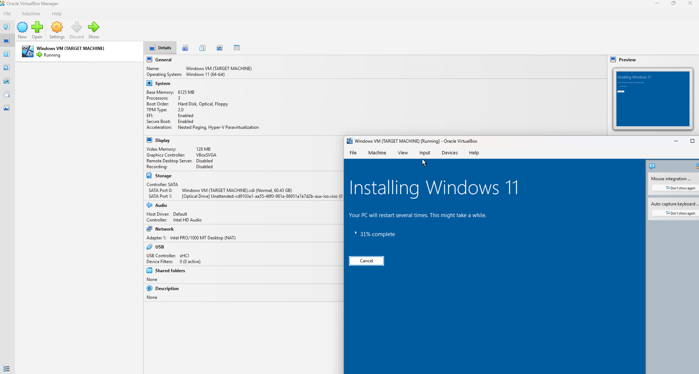
*Installing Windows 11 on the VM — first step to create target environment.*

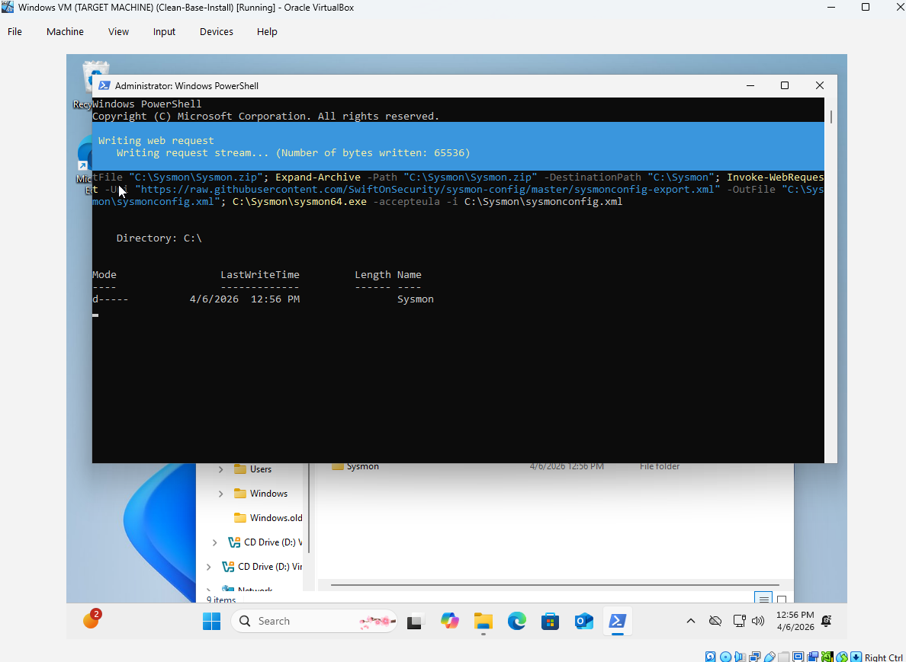
*Installing Sysmon via PowerShell to enable detailed event logging.*

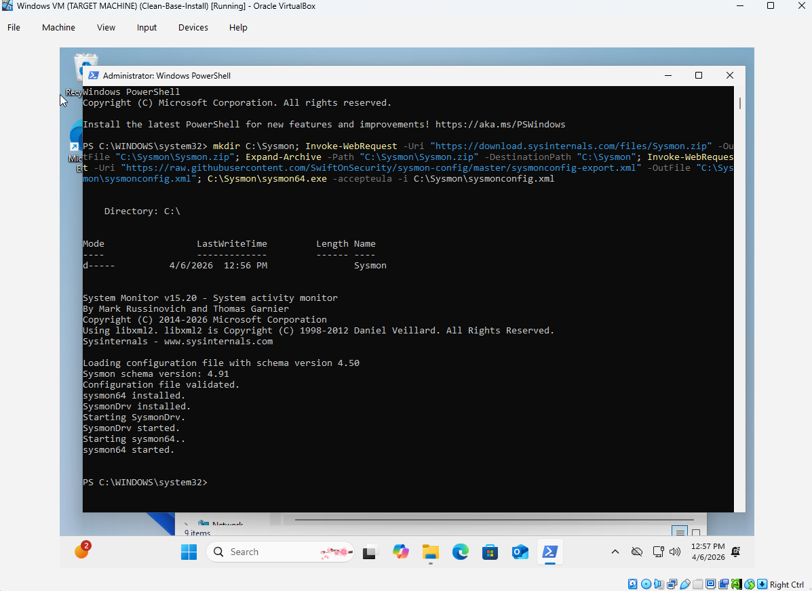
*Sysmon installation verified successfully in PowerShell.*

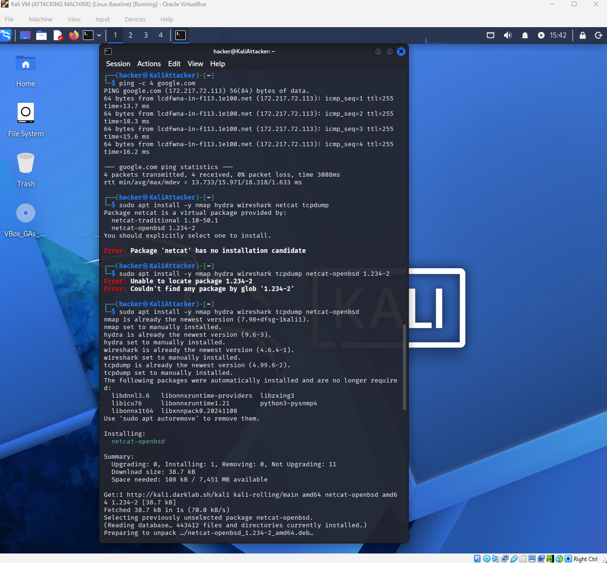
*Installing penetration testing tools on Kali Linux.*

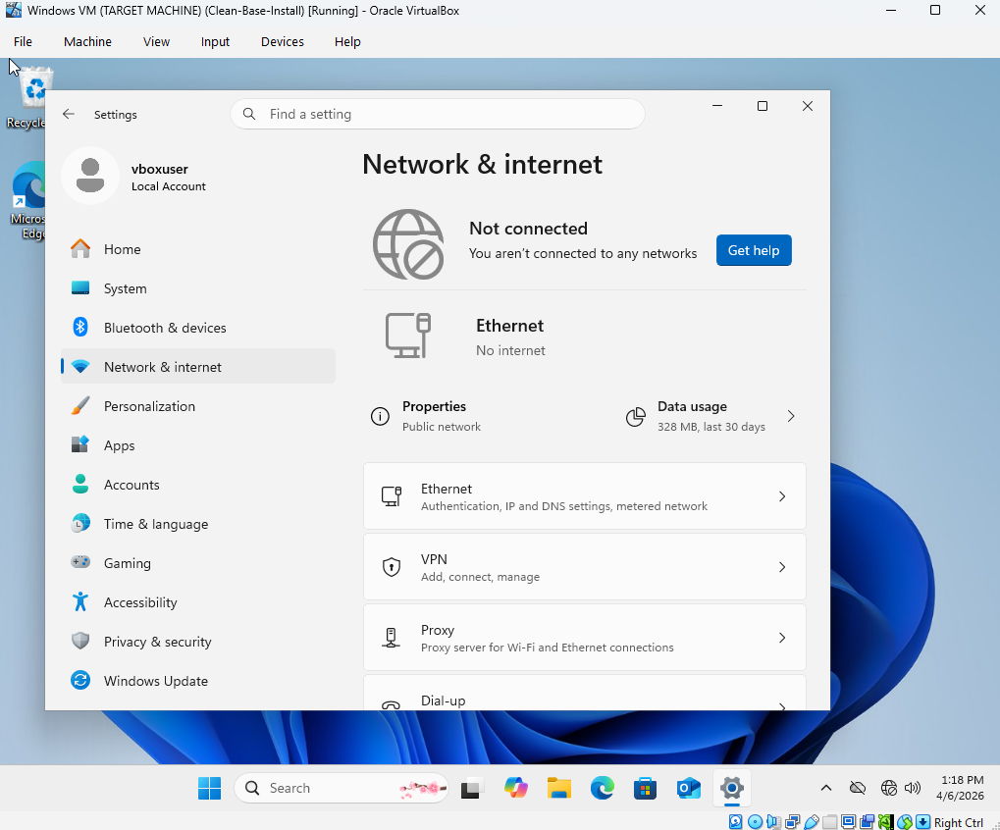
*Configuring isolated internal network to ensure lab VMs can communicate without affecting the host network.*

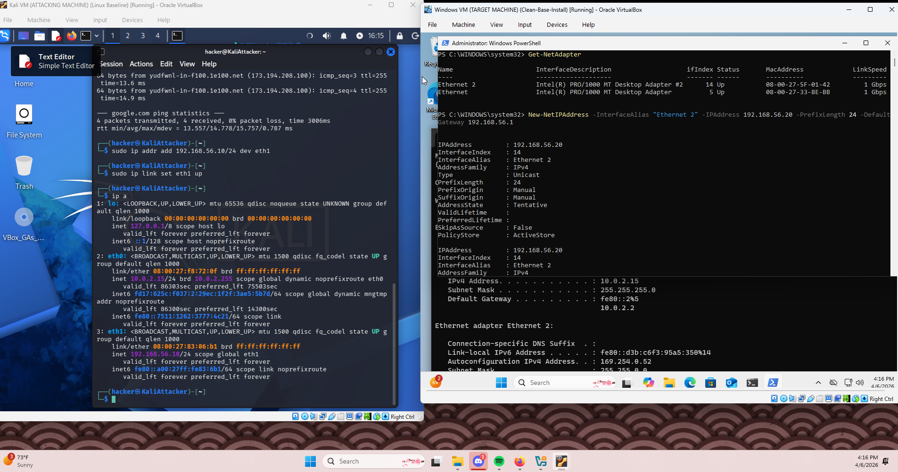
*Configuring static IP addresses for both VMs for reliable communication.*

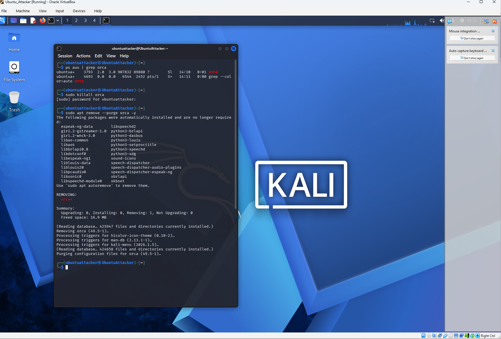
*Quality-of-life adjustments in the VM CLI to improve usability.*

---

### Troubleshooting

*Resolving static IP conflicts during setup.*

*Initial stealth port scans failed due to Windows Firewall — highlights importance of defensive settings.*

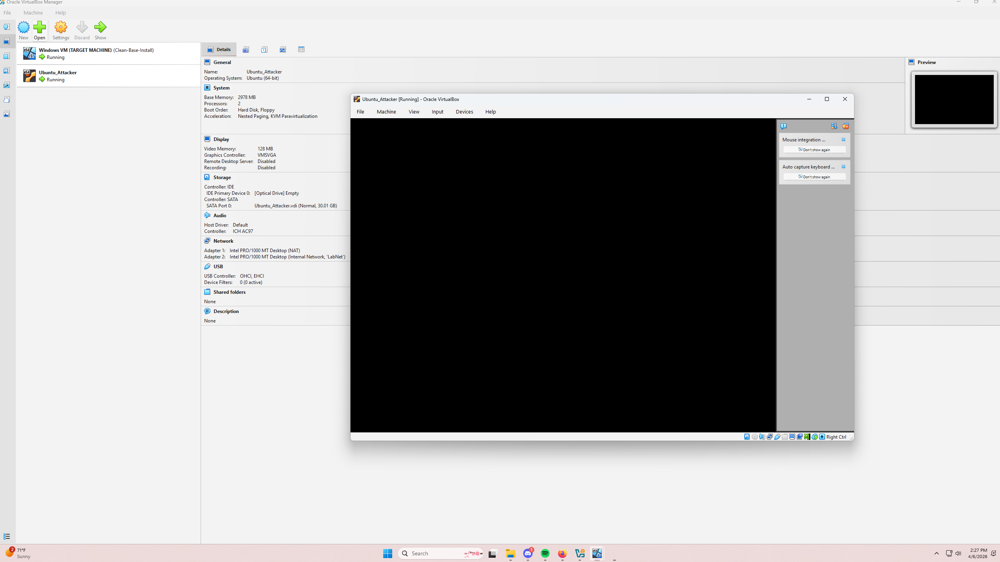
*Adjusting Kali boot parameters to fix VM boot issues.*

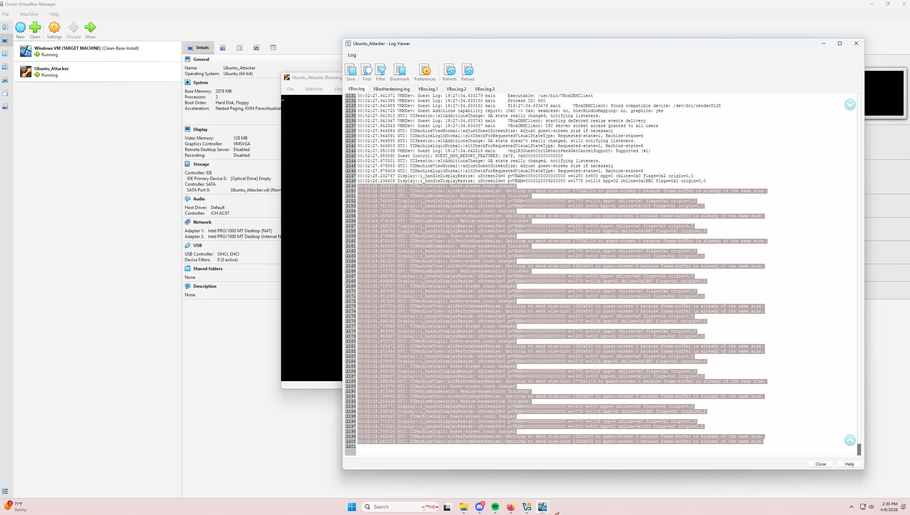
*Fixing Kali VM display issues to ensure proper usability.*

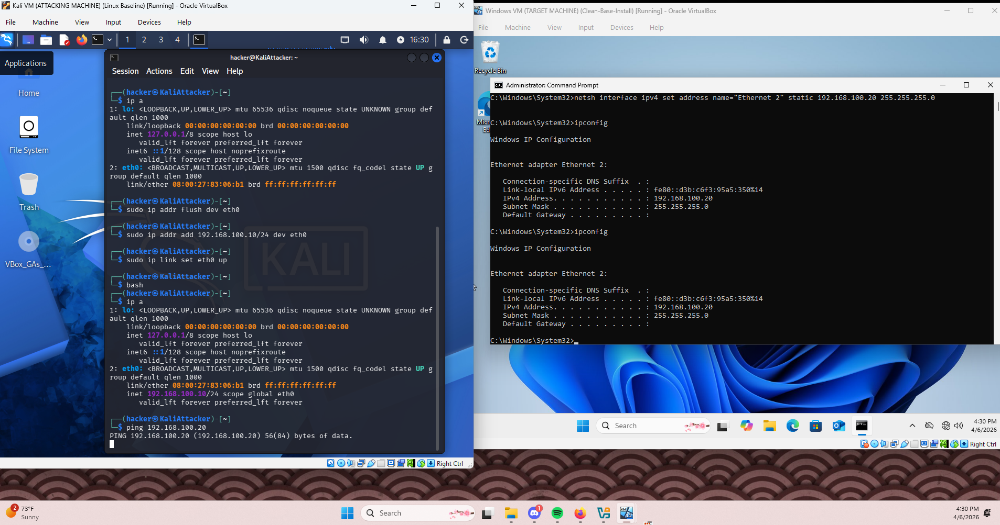
*Troubleshooting IPv4 static addressing to ensure both VMs could communicate.*

---

### Scanning Results

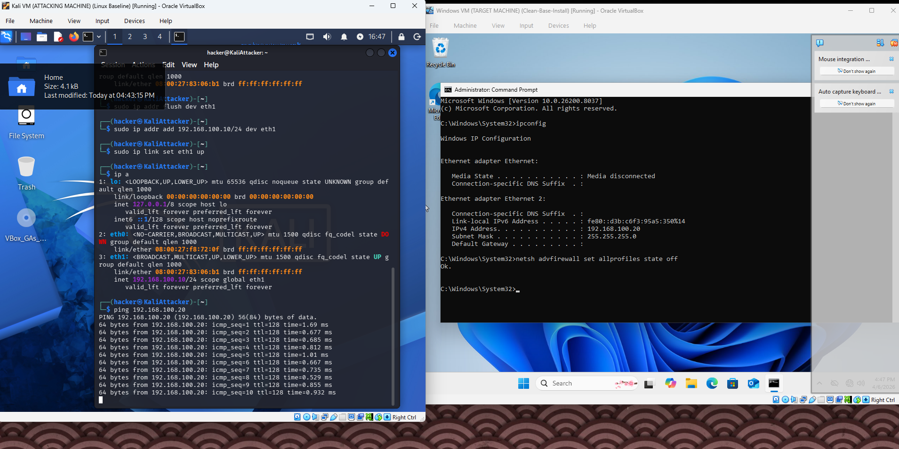
*Ping test confirming network connectivity between Windows and Linux VMs.*

*First successful Nmap port scan targeting the Windows RDP port — validates red team scanning activity.*

---

### Log Analysis

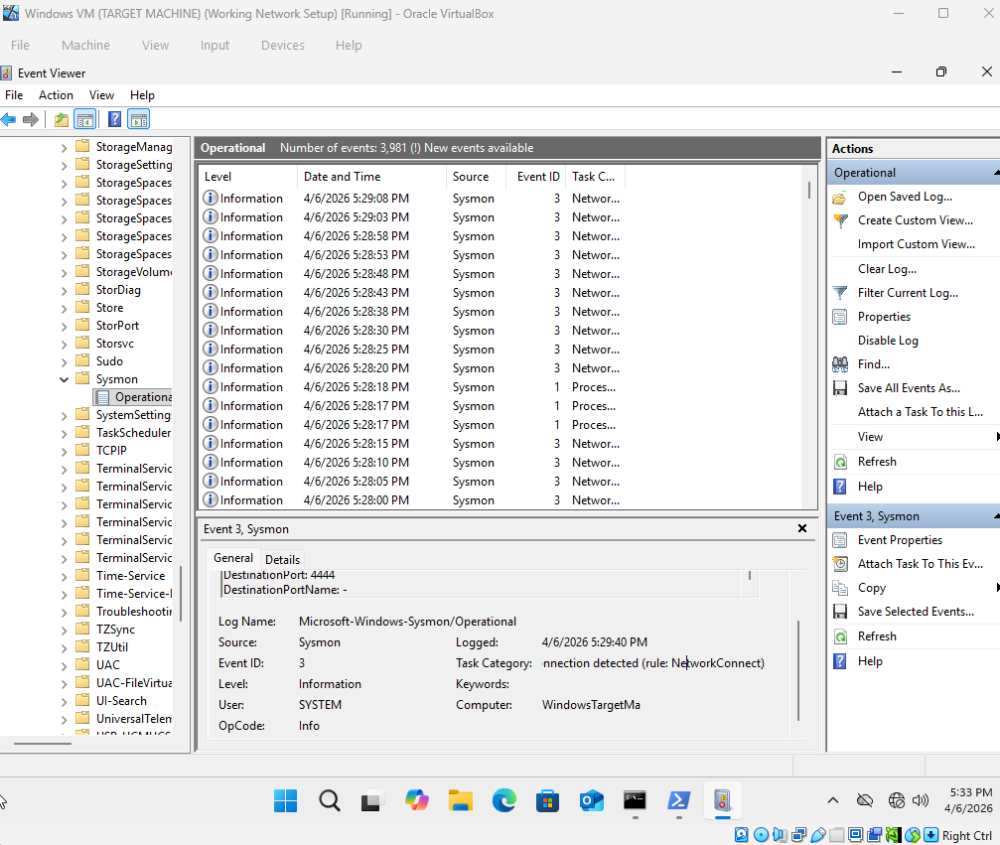
*Sysmon logs showing connection attempts from Linux VM — captures evidence of network scanning.*

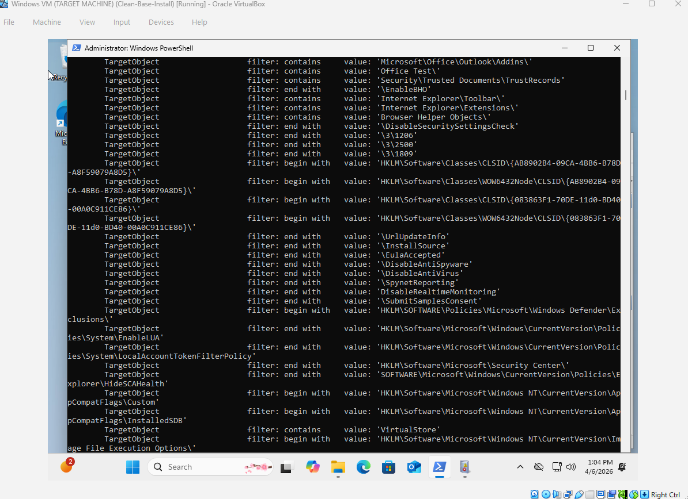
*Sysmon running status verified in PowerShell.*

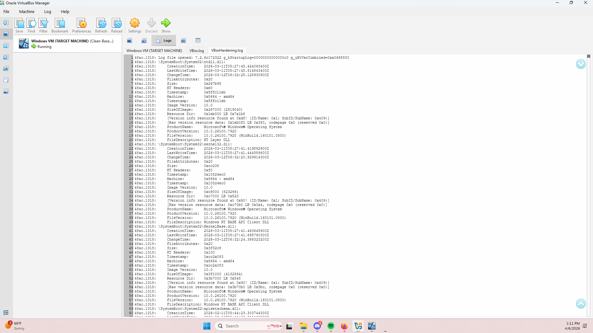
*Detailed Sysmon log results in Windows VM — demonstrates defender perspective.*

---

## How to Use This Repo

1. Review the screenshots for a visual walkthrough of the lab setup, execution, and troubleshooting.  
2. Read through the README to understand the project goals, methods, and results.  
3. Use this as a baseline for building your own cybersecurity lab environment or for learning red team vs blue team concepts.

---

## Next Steps

- Expand the lab by adding active defense tools such as additional IDS/IPS or EDR solutions.  
- Automate log collection and analysis with scripts or SIEM integration.  
- Perform more advanced penetration testing scenarios.  
- Expand the lab to conduct vulnerability testing and analysis.

---

## Contact / Contributions

This lab was created as a personal learning project. Contributions and feedback are welcome!

---

*Last updated: April 2026*
